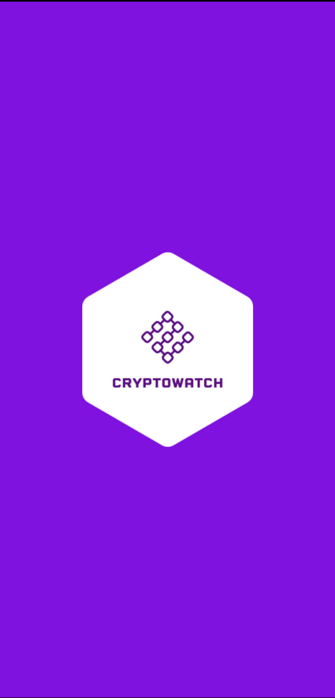
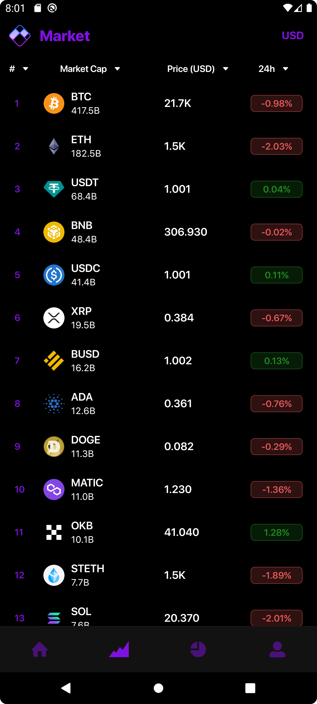
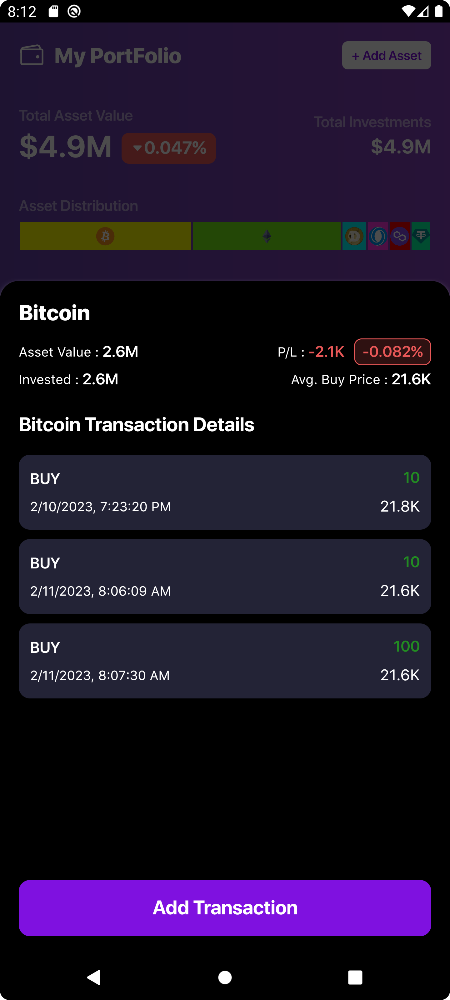
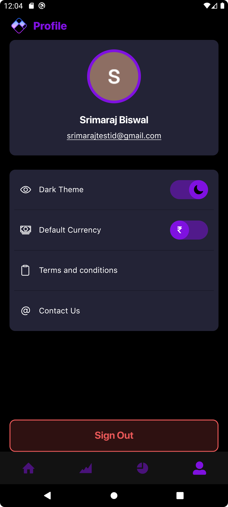

## CryptoWatch: A platform to track the crypto market, prices, trends news and Portfolio P/Ls

## Table of Contents

- Pre-requisites
- Getting Started
- File and Directories
- Screenshots
- Contact

**Pre-requisites**

1.  Nodejs version 14.15.5
2.  React native 0.70.6

**Getting Started(Local)**

1. Download the zip or clone the Git repository. url: https://github.com/srimaraz/cryptoWatch.git
2. Open the terminal and Change directory to the project folder (root).
3. Install the dependencies using the command **yarn**.
4. .env file to be obtained from the repo owner.
5. **For iOS:** add cocoapod dependencies using **cd ios && pod install**.
6. Start the application server using the command **yarn start**.
7. Run the build in target Emulator **yarn android/ yarn ios**.

**Files and directories**

1. **in src** - screens, utils, navigations, atoms, molecules, organisms,utils, assets, publicPages
2. **screenshots** - android screenshots
3. **root/config** - themes and contexts.
4. **root/assets** - font files

## Screenshots

## Android:

## ios

## Any issues, Feel free to reach out to me at srimaraj.biswal99@gmail.com
